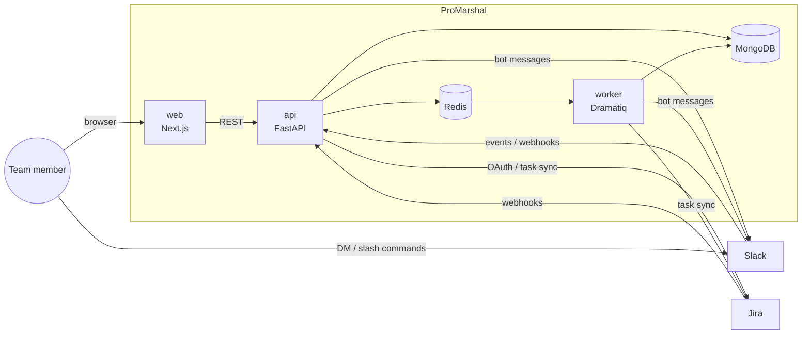
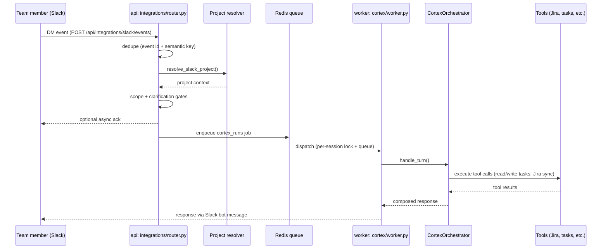

# ProMarshal

[](./LICENSE)
[](https://github.com/ProMarshal/ProMarshal/actions/workflows/api-tests.yml)

**Open-Source Agentic Framework for Project Management Assistant** — with project intelligence that drives your team forward from inside Slack and Jira, without anyone filling out a status report.

🔗 [promarshal.ai](https://promarshal.ai/)

It runs scheduled check-ins over Slack DM, extracts action items from conversation, syncs task status to Jira, and keeps a live project health view — all from where your team already works.

---

## Features

- **Action Agent (Cortex)** — a Slack-native conversational assistant: create/update/reassign tasks, add comments, and query project status without leaving Slack.
- **Cadence Agent** — automated, agenda-based Slack standups that message teammates, collect responses, and sync status back to Jira.
- **Poll Agent (Team Poll)** — instant async team polls over Slack DM, no meeting required.
- **Action item tracking** — captures action items from conversation and comments, infers owner and due date, and follows up until resolved.
- **Live PM Board & Pulse** — a computed, real-time project health view (not a static snapshot), served from a single composed backend endpoint.
- **Two-way Jira sync** — webhook-driven updates from Jira, and task mutations pushed back from Slack conversations.

## Architecture



- **web/** — Next.js (App Router) frontend, NextAuth-based session handling
- **api/** — FastAPI backend; owns integrations, the agent runtime (`cortex/`, `planner/`, `cadence/`), and the scheduler
- **worker** — Dramatiq background worker for queued jobs (Slack/Jira events, agent runs, extraction)
- **MongoDB** — system of record, plus a per-project "Brain" collection for tasks/sessions
- **Redis** — queue backend, caching, and Cortex/Slack ingress locking

Full, code-verified architecture writeup: [`docs/architecture/system-architecture.md`](./docs/architecture/system-architecture.md).

## Data Flow: Slack Message to Agent Response

How a Slack DM reaches Cortex (the conversational agent) and gets a response, end to end:



See [`docs/architecture/system-architecture.md`](./docs/architecture/system-architecture.md#11-slack-dm-to-cortex-sequence-ascii) for the code-verified version of this flow, including dedupe/locking details.

## Tech Stack

- **Frontend:** Next.js, TypeScript, Tailwind CSS v4, NextAuth
- **Backend:** Python 3.10+, FastAPI, Motor (async MongoDB)
- **Queue/Workers:** Redis, Dramatiq
- **Database:** MongoDB
- **Auth:** Google OAuth, Email OTP
- **Integrations:** Slack API, Jira REST API (Atlassian OAuth 2.0)
- **AI:** Pluggable — OpenAI, Anthropic, Groq
- **Security:** Fernet-encrypted OAuth token storage

## Quick Start

```bash
git clone https://github.com/ProMarshal/ProMarshal.git
cd ProMarshal
```

The app **will not start** without MongoDB and Redis running first — `python run.py` connects to MongoDB on boot and fails immediately if it can't reach it. You'll also need a Google OAuth client and at least one LLM provider key before login/AI features work. Condensed version, in order:

```bash
# 0. Start MongoDB and Redis first - the API will not boot without them
docker run -d -p 27017:27017 mongo:latest
docker run -d -p 6379:6379 redis:latest

# 1. Backend (separate terminal)
cd api && python -m venv venv && venv\Scripts\activate
pip install -r requirements.txt
cp .env.example .env   # edit with your values - MONGODB_URI, ENCRYPTION_KEY, etc.
python run.py

# 2. Worker (separate terminal)
cd api && venv\Scripts\activate
python start_dramatiq_worker.py

# 3. Frontend (separate terminal)
cd web && npm install
cp .env.example .env.local   # edit with your values - AUTH_SECRET, GOOGLE_CLIENT_ID, etc.
npm run dev
```

**These are four separate long-running processes across four terminals** (MongoDB/Redis containers run in the background, but backend/worker/frontend each occupy their own terminal). None of this works without real config values in `.env`/`.env.local` — placeholders in the example files will not connect to anything.

**For the full setup — every environment variable, Slack/Jira app registration steps, production Docker deployment, and troubleshooting — see [`docs/SETUP.md`](./docs/SETUP.md).** The condensed steps above are the minimum shape of the stack, not a copy-paste-and-done path.

## Documentation

| Doc | Covers |
|---|---|
| [`docs/SETUP.md`](./docs/SETUP.md) | Complete setup: env vars, Google/Slack/Jira app registration, Docker deployment, troubleshooting |
| [`docs/architecture/system-architecture.md`](./docs/architecture/system-architecture.md) | Code-verified system architecture |
| [`docs/architecture/flows/cortex-agent-harness-flow.md`](./docs/architecture/flows/cortex-agent-harness-flow.md) | How a Cortex turn is composed: orchestrator, prompt assembly, agent harness, LLM gateway |
| [`docs/architecture/invariants.md`](./docs/architecture/invariants.md) | Architectural invariants the codebase enforces |
| [`docs/contracts/`](./docs/contracts/) | Subsystem contracts (Cortex, Cadence, Team Poll, project lifecycle, etc.) |
| [`api/README.md`](./api/README.md) | Backend API reference and data model notes |
| [`CONTRIBUTING.md`](./CONTRIBUTING.md) | How to contribute |
| [`SECURITY.md`](./SECURITY.md) | Vulnerability reporting |

## API Overview

Interactive API docs are available at `http://localhost:8000/docs` when running locally (disabled in production). A few key endpoints:

- `POST /api/projects/` · `GET /api/projects?user_id={id}` — project CRUD
- `GET /api/integrations/slack/connect` / `GET /api/integrations/jira/connect` — integration OAuth flows
- `POST /api/integrations/slack/events` — Slack event ingress (Cortex handoff)
- `POST /api/jira/webhooks/{project_id}/task-updated` — Jira → Brain sync
- `POST /api/cron/tick` — scheduler trigger (reminders, cadence, team polls — see [`docs/SETUP.md`](./docs/SETUP.md#7-scheduler--reminders-trigger))

## Roadmap

- [ ] Meeting transcription and action item extraction (Google Meet)
- [ ] Email integration for communication tracking
- [ ] AI-powered project insights and recommendations
- [ ] ClickUp, Linear, Notion integrations
- [ ] Project knowledge base / memory system
- [ ] Analytics dashboard

## Contributing

Contributions are welcome — see [`CONTRIBUTING.md`](./CONTRIBUTING.md) for local setup, coding standards ([`RULES.md`](./RULES.md)), and how to open a PR.

## License

[AGPL-3.0](./LICENSE)
