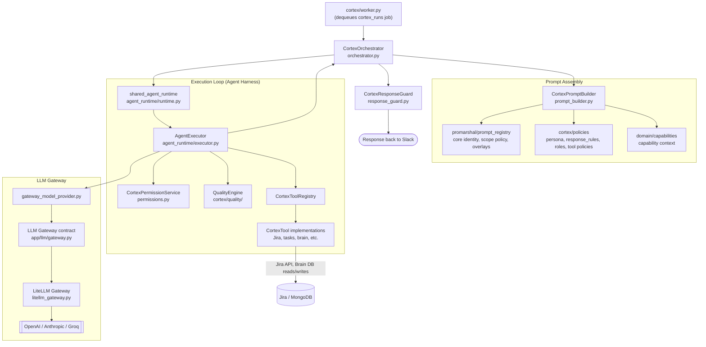

# Cortex Agent Harness Flow (Code-Verified)

Last verified against code: 2026-08-19.

## Scope

This flow documents how a single Cortex turn is composed internally, once `CortexOrchestrator.handle_turn()` is invoked: prompt assembly, the shared agent runtime's (agent harness) tool-calling loop, and the LLM gateway chain. It picks up exactly where [`cortex-slack-runtime-flow.md`](./cortex-slack-runtime-flow.md) leaves off (that doc covers Slack ingress through queue dispatch up to `shared_agent_runtime.run(...)`).

## Entry Points

- Orchestrator: `api/app/cortex/orchestrator.py`
- Prompt assembly: `api/app/cortex/prompt_builder.py`
- Shared agent runtime (agent harness): `api/app/agent_runtime/runtime.py`, `api/app/agent_runtime/executor.py`
- LLM gateway: `api/app/agent_runtime/gateway_model_provider.py`, `api/app/llm/gateway.py`, `api/app/llm/litellm_gateway.py`
- Response guard: `api/app/cortex/response_guard.py`

## Flow (Diagram)

## Key Mechanics Verified

- The **LLM Gateway** (`app/llm/gateway.py`) is a provider-agnostic contract; `litellm_gateway.py` is the concrete implementation routing to OpenAI/Anthropic/Groq via LiteLLM. `agent_runtime/gateway_model_provider.py` is the adapter that lets the executor's tool-calling loop speak to the gateway without depending on a specific provider.
- **Prompt assembly is layered**: `promarshal/prompt_registry` holds the base identity/scope/response-rules text and per-feature overlays; `cortex/policies/` holds persona, role, and per-tool policy markdown. `CortexPromptBuilder` composes both plus live capability context into the final system prompt for a turn.
- **The execution loop (agent harness) is shared**, not Cortex-specific — `agent_runtime/runtime.py` and `executor.py` are also used by Cadence's agent runtime bindings (see [`system-architecture.md` section 3.2](../system-architecture.md#32-shared-agent-runtime)).
- **`CortexResponseGuard`** is the last gate before a response leaves the orchestrator — separate from `QualityEngine`, which gates operations mid-execution inside the tool-calling loop.
